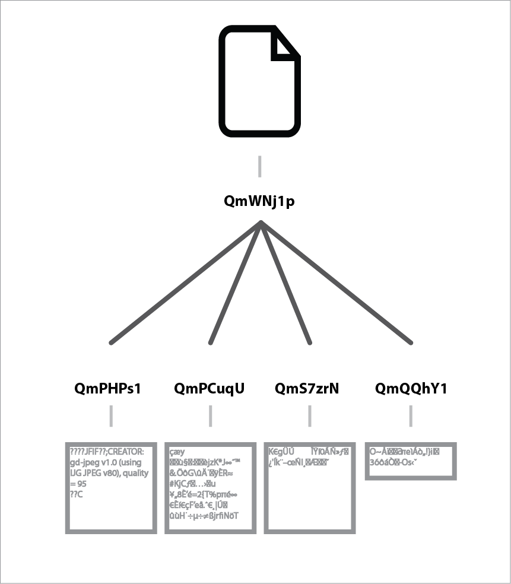

# Lesson: Turn a File into a Merkle Tree

*Work in Progress* _This is the content from [this existing Lesson](https://ipfs.io/ipfs/QmTkzDwWqPbnAh5YiV5VwcTLnGdwSNsNTn2aDxdXBFca7D/example#/ipfs/QmQwAP9vFjbCtKvD8RkJdCvPHqLQjZfW7Mqbbqx18zd8j7/data/readme.md) vaguely re-framed to fit the Lesson framework._

## Goals
* Explain how IPFS represents Files as Merkle trees
* Explore the Merkle Tree Blocks that make up a File in IPFS

## Steps

### Step 1: Download the sample file and add it to IPFS

For this lesson we need a file that's larger than 256kb. Download this image: [tree-in-cosmos.jpg](https://raw.githubusercontent.com/flyingzumwalt/decentralized-web-primer/master/samples/tree-in-cosmos.jpg) (863kb)

Save it as "tree-in-cosmos.jpg" and then add it to IPFS

```sh
$ ipfs add tree-in-cosmos.jpg
added QmWNj1pTSjbauDHpdyg5HQ26vYcNWnubg1JehmwAE9NnU9
```

### Step 2:

Let's look at how IPFS represented that file internally by passing the content's hash to the `ipfs ls` command:

```
ipfs ls -v QmWNj1pTSjbauDHpdyg5HQ26vYcNWnubg1JehmwAE9NnU9
Hash                                           Size   Name
QmPHPs1P3JaWi53q5qqiNauPhiTqa3S1mbszcVPHKGNWRh 262158
QmPCuqUTNb21VDqtp5b8VsNzKEMtUsZCCVsEUBrjhERRSR 262158
QmS7zrNSHEt5GpcaKrwdbnv1nckBreUxWnLaV4qivjaNr3 262158
QmQQhY1syuqo9Sq6wLFAupHBEeqfB8jNnzYUSgZGARJrYa 76151  
```

This returned a bunch of hashes. That's different from what happened in the [lesson on adding file content to ipfs](../../files-on-ipfs/lessons/add-and-retrieve-file-content.md), where you only got one hash back. This is because ipfs breaks files into content _blocks_ that are each about 256kb and then uses a **hash tree** to represent how they fit together.

This is one example of how IPFS uses hash trees, also known as **Merkle DAGs**, to represent information.

<div class="alert alert-info">
This kind of hash tree is formally known as a <b>Merkle DAG</b> -- this is because the technical term for this  type of data structure is a <i>Directed Acyclic Graph</i>, or <i>DAG</i>, and a mathematician named Ralph <i>Merkle</i> invented them. Hence: Merkle DAG, or merkledag.
</div>



In this case, the hash for our file `QmWNj1pTS...` is the hash of the **root block** in a DAG that contains 4 sub-blocks.  The output from `ipfs ls` lists those sub-blocks and their size.

Sometimes sub-blocks have sub-blocks of their own. That's when a Merkle DAG starts looking like a tree. This diagram shows a Merkle DAG with three layers of sub-blocks.:

  

_Do you think it looks like an upside-down tree?_

### Step 3: Explore The Hash Tree

The `ipfs refs` and `ipfs object links` commands are other ways to get the listing of sub-blocks in the tree.

Try these:
```sh
$ ipfs refs QmWNj1pTSjbauDHpdyg5HQ26vYcNWnubg1JehmwAE9NnU9
ipfs object links -v QmWNj1pTSjbauDHpdyg5HQ26vYcNWnubg1JehmwAE9NnU9
```

If the sub-blocks had more sub-blocks within them, you would be able to use these commands to get the hashes of those sub-sub-blocks.  For example:

```sh
$ ipfs object links -v QmPHPs1P3JaWi53q5qqiNauPhiTqa3S1mbszcVPHKGNWRh
```
But this doesn't return anything because there aren't sub-blocks within `QmPHPs1P...`

### Step 4: Read the content back out of IPFS

If you use `ipfs cat` to read the content back out of ipfs, it handles re-assembling the file from the hash tree. For example, the following command will read our sample image out of ipfs and write the content into a new file called "copy-of-tree-in-cosmos.jpg".  Run the command and then open the new file to confirm that the image is still intact.

```sh
$ ipfs cat QmWNj1pTSjbauDHpdyg5HQ26vYcNWnubg1JehmwAE9NnU9 > copy-of-tree-in-cosmos.jpg
```

### Step 5: Examine the blocks individually

Use these commands to examine the blocks in the hash tree:
* `ipfs block stat` will tell you the exact size of a given block (without its
children)
* `ipfs refs` will tell you all the children of that block. This is a more suitable command for scripting something to run on each child block of a given object.
* `ipfs ls` or `ipfs object links` will show you all children and their sizes.


### Step 6: Read the Contents of a sub-block

In some cases you want to retrieve sub-blocks from a tree. You can use `ipfs cat` to do that. You can test that with the sub-bocks from our image.

```sh
$ ipfs cat QmPHPs1P3JaWi53q5qqiNauPhiTqa3S1mbszcVPHKGNWRh
```

The output will look similar to this because it's image content, not text:
```
<FF><D8><FF><E0>^@^PJFIF^@^A^A^@^@^A^@^A^@^@<FF><FE>^@;CREATOR: gd-jpeg v1.0 (using IJG JPEG v80), quality = 95
<FF><DB>^@C^@^B^A^A^A^A^A^B^A^A^A^B^B^B^B^B^D^C^B^B^B^B^E^D^D^C^D^F^E^F^F^F^E^F^F^F^G  ^F^G     ^G^F^F^H^K^H   


???w!1AQaq"2B????	#3R?br?
$4?%?&'()*56789:CDEFGHIJSTUVWXYZcdefghijstuvwxyz??????????????????????????????????????????????????????????????????????????
,?y?ՠ|ѿiMgᦧk?_?WN??W????F!%T 8?W???I$uZ?????K?\?olng?H|?????@?#8?En?1??;
```

### Step 7: Assemble the Pieces Manually

`ipfs cat` allows you read the contents of each block and it also allows you to _concatenate_ many inputs. This means we can use `ipfs cat` to re-build our image by passing the hashes of all our sub-blocks into that command.

```sh
ipfs cat QmPHPs1P3JaWi53q5qqiNauPhiTqa3S1mbszcVPHKGNWRh QmPCuqUTNb21VDqtp5b8VsNzKEMtUsZCCVsEUBrjhERRSR QmS7zrNSHEt5GpcaKrwdbnv1nckBreUxWnLaV4qivjaNr3 QmQQhY1syuqo9Sq6wLFAupHBEeqfB8jNnzYUSgZGARJrYa > manually-rebuilt-tree-in-cosmos.jpg
```

## Bonus Steps

Some things to try:
* Write a script that uses `ipfs refs` and `ipfs cat` to rebuild a file from its root hash

## Explanation

Merkle DAGs are the core concept of IPFS. Merkle DAGs are also at the core of technologies like git, bitcoin and dat.

Hash trees are made up of _content blocks_ that are each identified by their cryptographic hash. You can reference any of these blocks using its hash, which allows you to build trees of blocks that reference their "sub blocks" using the hashes of those sub blocks.

The `ipfs add` command will create a Merkle DAG out of the data in the files you specify. It follows the unixfs data format when doing this. What this means is
that your files are broken down into blocks, and then arranged in a tree-like structure using 'link nodes' to tie them together. A given file's 'hash' is actually the hash of the root (uppermost) node in the DAG. for a given DAG, you can easily view the sub-blocks under it with `ipfs ls`.

## Next Steps

Next, examine [The Cryptographic Hash](/ipfs-dag/lessons/crypto-hash.md)

