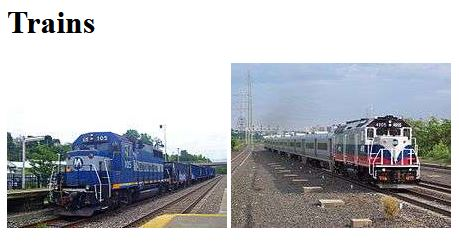

# Lesson: Generate and Use a New IPNS Name Keypair

This lesson shows you how to generate an new name keypair and use it to publish a different IPNS webpage than your original Peer ID. 

## Goals

After doing this Lesson you will be able to
* Generate a new name keypair and use it along with IPNS.

## Steps

### Step 1: Generate a new name keypair

Imagine that you want to create a new name keypair called "trains". Run the following command:

```sh
$ ipfs key gen --type=rsa --size=2048 trains
```

Output should be a hash similar to the following:

```sh
QmexZbauipkBBrV8vZv8WjeYe8F7ojCm4UZXuAhxk5vFF1
```

Now you might list the keys that you have on your local node:

```sh
$ ipfs key list
self
trains
```

Note that "self" is the default name for the keypair of your Peer ID. This keypair is used when you `ipfs name publish` without specifying the name.

### Step 2: Create new webpage directory and content

Create a new webpage directory in your user's home directory for trains.

```sh
$ cd ~  (or cd %userprofile% on Windows)
$ mkdir trains-webpage
$ cd trains-webpage/
```

Download 2 train images using ipfs:

``` sh
$ ipfs cat QmXoypizjW3WknFiJnKLwHCnL72vedxjQkDDP1mXWo6uco/I/m/MNRR_maintenance_train_at_Beacon.jpg > train1.jpg
$ ipfs cat QmXoypizjW3WknFiJnKLwHCnL72vedxjQkDDP1mXWo6uco/I/m/New_Jersey_Transit_train_53_to_Port_Jervis.jpg > train2.jpg
```

Using a text editor, create a file called `index.html` and copy/paste the following content:

```sh
<!DOCTYPE html>
<html>
<head>
  <title>Trains</title>
</head>
<body>
  <h1>Trains</h1>
  
  
</body>
</html>
```

Save `index.html` in the `trains-webpage` directory and close the text editor. If you like, you may open `index.html` in the browser to see the webpage.




### Step 3: Work-in-progress

Run the following commands to update your webpage to IPFS:

```sh
$ cd ..
$ ipfs add -r simple-webpage/
```

You should see output like the following:

```sh
added Qmd286K6pohQcTKYqnS1YhWrCiS4gz7Xi34sdwMe9USZ7u simple-webpage/cat.jpg
added QmWRijdpZxJVhbUdEmvt2xD4GdCns3EVmTLBRXrJusNmGf simple-webpage/index.html
added QmPx2wNJK3tT5AMPuZwjNAMUkVyR1UB8UYAxx4QmLZovtx simple-webpage/secret.html
added QmXw1gREZvLbNtpEfSCA6cP8SgwhMkbPJrkC93A97uXHqf simple-webpage
 433.27 KiB / 433.27 KiB [=============================================] 100.00%
```

Because the content in the `simple-webpage` directory has been changed, the final hash for the directory is now different. You might notice that the hash for `cat.jpg` has not changed, as no changes were made to that file.

The IPFS hash on the last line is the hash you will use to view your webpage. Note that your own hash may be different. Use your IPFS hash and open your webpage in the browser like so:

`https://ipfs.io/ipfs/your-webpage-hash`

You should see the "Nice Kitty Update" webpage. Also try to access the `secret.html` webpage:

`https://ipfs.io/ipfs/your-webpage-hash/secret.html`

And now you can republish your updated webpage to IPNS:

```sh
$ ipfs name publish your-webpage-hash
```
You should see output like the following:

```sh
Published to QmRX....xQTp: (your peer id)
/ipfs/QmZh....your-webpage-hash....9sjT
```

So you can see that when you republish the updated IPFS webpage to IPNS, it will again tie your Peer ID to your updates. This is the power of being able to use IPNS to point to your updated webpage.

View the updated webpage using the IPNS link with your Peer ID:

`https://ipfs.io/ipns/your-peer-id`

and also view the `secret.html` webpage:

`https://ipfs.io/ipns/your-peer-id/secret.html`

### Step 3: Work-in-progress

## Explanation

The IPFS hash for your webpage will always point to the exact same content, this is one of the fundamental ideas of the "Permanent Web". If you make changes to your webpage, then your new IPFS content will have a different hash. If you use IPNS to tie your webpage to your Peer ID, then you can make changes to your webpage and publish your URL using the IPNS hash.

## Next Steps

Proceed to the next lesson to learn how to [Modify Your Webpage and Republish to IPNS](/publishing-changes/lessons/modify-republish.md)
